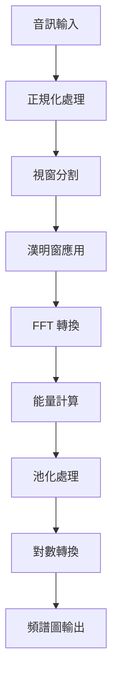

# AudioProcessor.cpp 原始碼分析

## 概述

[`AudioProcessor`](src/AudioProcessor.cpp:9) 是一個音訊信號處理類別，主要功能是將時域的音訊樣本轉換為頻域的頻譜圖（Spectrogram），用於語音辨識或音訊分析的前處理。

## 系統架構



## 類別成員與初始化

### 建構函式 (第 9-31 行)

```cpp
AudioProcessor(int audio_length, int window_size, int step_size, int pooling_size)
```

**參數說明：**
- `audio_length`: 音訊樣本總長度
- `window_size`: 每個分析視窗的大小
- `step_size`: 視窗滑動步進大小
- `pooling_size`: 池化處理的大小

**初始化流程：**

1. **FFT 大小計算** (第 15-19 行)
   ```cpp
   m_fft_size = 1;
   while (m_fft_size < window_size)
   {
       m_fft_size <<= 1;
   }
   ```
   - 找出大於等於 `window_size` 的最小 2 的冪次方
   - 使用位元左移運算加速計算

2. **記憶體配置** (第 20-23 行)
   - `m_fft_input`: FFT 輸入緩衝區
   - `m_fft_output`: FFT 輸出緩衝區（複數格式）
   - `m_energy`: 能量頻譜陣列

3. **池化輸出大小** (第 25 行)
   ```cpp
   m_pooled_energy_size = ceilf((float)m_energy_size / (float)pooling_size);
   ```
   - 計算池化後的輸出維度

4. **Kiss FFT 初始化** (第 28 行)
   ```cpp
   m_cfg = kiss_fftr_alloc(m_fft_size, false, 0, 0);
   ```
   - 配置 FFT 實數轉換設定

5. **漢明窗初始化** (第 30 行)
   ```cpp
   m_hamming_window = new HammingWindow(m_window_size);
   ```
   - 建立漢明窗物件以減少頻譜洩漏

### 解構函式 (第 33-40 行)

```cpp
AudioProcessor::~AudioProcessor()
{
    free(m_cfg);
    free(m_fft_input);
    free(m_fft_output);
    free(m_energy);
    delete m_hamming_window;
}
```

釋放所有動態配置的記憶體資源。

## 核心方法

### 1. get_spectrogram_segment (第 43-82 行)

處理單一視窗的頻譜計算，包含五個主要步驟：

#### 步驟 1：漢明窗應用 (第 46 行)
```cpp
m_hamming_window->applyWindow(m_fft_input);
```
減少頻譜洩漏效應。

#### 步驟 2：FFT 轉換 (第 48-51 行)
```cpp
kiss_fftr(
    m_cfg,
    m_fft_input,
    reinterpret_cast<kiss_fft_cpx *>(m_fft_output));
```
將時域信號轉換為頻域。

#### 步驟 3：能量計算 (第 53-59 行)
計算每個頻率點的功率譜密度：
```cpp
for (int i = 0; i < m_energy_size; i++)
{
    const float real = m_fft_output[i].r;
    const float imag = m_fft_output[i].i;
    const float mag_squared = (real * real) + (imag * imag);
    m_energy[i] = mag_squared;
}
```
$$\text{Energy}[i] = \text{real}^2 + \text{imag}^2$$

#### 步驟 4：平均池化 (第 61-76 行)
```cpp
for (int i = 0; i < m_energy_size; i += m_pooling_size)
{
    float average = 0;
    for (int j = 0; j < m_pooling_size; j++)
    {
        if (i + j < m_energy_size)
        {
            average += *output_src;
            output_src++;
        }
    }
    *output_dst = average / m_pooling_size;
    output_dst++;
}
```
- 使用平均池化降低頻譜解析度
- 採用 same padding 策略處理邊界

#### 步驟 5：對數轉換 (第 78-81 行)
```cpp
for (int i = 0; i < m_pooled_energy_size; i++)
{
    output[i] = log10f(output[i] + EPSILON);
}
```
- 轉換為對數尺度（dB）
- 加入 `EPSILON = 1e-6` 避免 log(0) 錯誤

### 2. get_spectrogram (第 84-124 行)

處理完整音訊串流，產生 2D 頻譜圖。

#### 前處理階段

**均值計算** (第 88-94 行)
```cpp
float mean = 0;
for (int i = 0; i < m_audio_length; i++)
{
    mean += reader->getCurrentSample();
    reader->moveToNextSample();
}
mean /= m_audio_length;
```
$$\text{mean} = \frac{\sum_{i=0}^{N-1} \text{sample}[i]}{N}$$

**最大值計算** (第 96-102 行)
```cpp
reader->setIndex(startIndex);
float max = 0;
for (int i = 0; i < m_audio_length; i++)
{
    max = std::max(max, fabsf(((float)reader->getCurrentSample()) - mean));
    reader->moveToNextSample();
}
```
$$\text{max} = \max(|\text{sample}[i] - \text{mean}|)$$

#### 視窗處理循環 (第 104-123 行)

1. **正規化** (第 109-113 行)
   ```cpp
   for (int i = 0; i < m_window_size; i++)
   {
       m_fft_input[i] = ((float)reader->getCurrentSample() - mean) / max;
       reader->moveToNextSample();
   }
   ```
   範圍歸一化到 [-1, 1]
   $$\text{normalized} = \frac{\text{sample} - \text{mean}}{\text{max}}$$

2. **零填充** (第 115-118 行)
   ```cpp
   for (int i = m_window_size; i < m_fft_size; i++)
   {
       m_fft_input[i] = 0;
   }
   ```
   將 FFT 輸入的剩餘部分填充為 0

3. **頻譜計算** (第 120 行)
   ```cpp
   get_spectrogram_segment(output_spectrogram);
   ```
   呼叫 `get_spectrogram_segment` 處理當前視窗

4. **輸出指標移動** (第 122 行)
   ```cpp
   output_spectrogram += m_pooled_energy_size;
   ```
   移動到下一行頻譜圖

## 關鍵技術特點

### 1. 記憶體管理
- 使用 C 風格的 `malloc`/`free` 進行記憶體管理
- 適合嵌入式系統的資源控制
- 需要手動管理生命週期

### 2. 數值穩定性
- 正規化處理避免數值溢位
- 對數轉換前加入 EPSILON 避免除零錯誤
- 使用均值中心化減少直流偏移

### 3. 效能優化
- 池化降低輸出維度，減少後續計算量
- 使用高效的 Kiss FFT 函式庫
- 位元運算加速 2 的冪次計算
- 零填充到 2 的冪次方以優化 FFT 性能

### 4. 信號處理流程
完整的 STFT (Short-Time Fourier Transform) 實作，符合標準音訊特徵提取流程：
- 分幀（Framing）
- 加窗（Windowing）
- FFT 轉換
- 功率譜計算
- 池化與對數壓縮

## 頻譜圖輸出格式

**輸出維度：**
- 時間軸：`(audio_length - window_size) / step_size` 幀
- 頻率軸：`m_pooled_energy_size` 個頻率 bin
- 數值範圍：對數能量（dB 尺度）

**輸出陣列結構：**
```
[Frame0_Freq0, Frame0_Freq1, ..., Frame0_FreqN,
 Frame1_Freq0, Frame1_Freq1, ..., Frame1_FreqN,
 ...
 FrameM_Freq0, FrameM_Freq1, ..., FrameM_FreqN]
```

## 依賴項

- **Kiss FFT**: 快速傅立葉轉換函式庫
  - 輕量級、適合嵌入式系統
  - 支援實數輸入的優化 FFT
- **HammingWindow.h**: 漢明窗實作
  - 減少頻譜洩漏
  - 改善頻率解析度
- **RingBuffer**: 環形緩衝區
  - 用於音訊資料的循環讀取
  - 適合串流音訊處理

## 使用場景

此類別適用於：
- 語音辨識前處理
- 語音喚醒詞檢測（Wake Word Detection）
- 音訊特徵提取
- 神經網路輸入準備
- 音訊分類任務

## 典型使用範例

```cpp
// 初始化
int audio_length = 16000;    // 1 秒音訊 @ 16kHz
int window_size = 320;        // 20ms 窗口
int step_size = 160;          // 10ms 步進
int pooling_size = 6;         // 池化大小

AudioProcessor processor(audio_length, window_size, step_size, pooling_size);

// 處理音訊
RingBufferAccessor reader(...);
float* spectrogram = new float[num_frames * pooled_energy_size];
processor.get_spectrogram(&reader, spectrogram);

// 使用頻譜圖進行後續處理（如餵入神經網路）
```

## 參數調整建議

### 視窗大小（window_size）
- 較大：更好的頻率解析度，較差的時間解析度
- 較小：更好的時間解析度，較差的頻率解析度
- 建議：16kHz 取樣率下，使用 320-512 樣本（20-32ms）

### 步進大小（step_size）
- 通常為窗口大小的 50%（50% overlap）
- 更小的步進：更密集的時間資訊，但計算量增加
- 建議：window_size / 2

### 池化大小（pooling_size）
- 控制頻率維度的下採樣程度
- 較大：減少特徵維度，降低計算成本
- 較小：保留更多頻率細節
- 建議：根據目標神經網路輸入大小調整

## 注意事項與限制

### 1. 硬編碼值
- **第 104 行**: `startIndex + 16000` 硬編碼了取樣率
  ```cpp
  for (int window_start = startIndex; window_start < startIndex + 16000 - m_window_size; ...)
  ```
  **建議**: 改為參數化，使用 `startIndex + m_audio_length - m_window_size`

### 2. 記憶體安全
- 使用原始指標，需確保呼叫者正確管理記憶體
- 輸出緩衝區大小必須由呼叫者事先計算並分配
- 建議：加入邊界檢查或改用智能指標

### 3. 執行緒安全
- 此類別非執行緒安全
- 多執行緒環境需要額外的同步機制
- 成員變數會在方法執行時被修改

### 4. 錯誤處理
- 缺乏記憶體分配失敗的檢查
- 建議：加入 nullptr 檢查和異常處理

### 5. 輸入資料假設
- 假設 RingBufferAccessor 有足夠的資料
- 沒有檢查輸入參數的合理性（如負數、零值）

## 效能考量

### 時間複雜度
- 單一視窗處理：O(n log n)，由 FFT 決定
- 完整頻譜圖：O(m × n log n)，其中 m 為幀數

### 空間複雜度
- O(fft_size)：常數空間，可重複使用緩衝區
- 輸出：O(frames × pooled_energy_size)

### 優化建議
1. 考慮使用固定點運算（嵌入式系統）
2. 可以使用 SIMD 指令加速向量運算
3. 池化操作可以與能量計算合併

## 延伸閱讀

- [短時傅立葉轉換 (STFT)](https://en.wikipedia.org/wiki/Short-time_Fourier_transform)
- [漢明窗函數](https://en.wikipedia.org/wiki/Window_function#Hann_and_Hamming_windows)
- [Kiss FFT 文件](https://github.com/mborgerding/kissfft)
- [語音信號處理基礎](https://en.wikipedia.org/wiki/Speech_processing)

## 版本資訊

**檔案**: `lib/audio_processor/src/AudioProcessor.cpp`
**分析日期**: 2026-01-25
**分析工具**: Roo Code Assistant

---

*此文件由自動化工具生成，用於技術參考與程式碼理解。*
